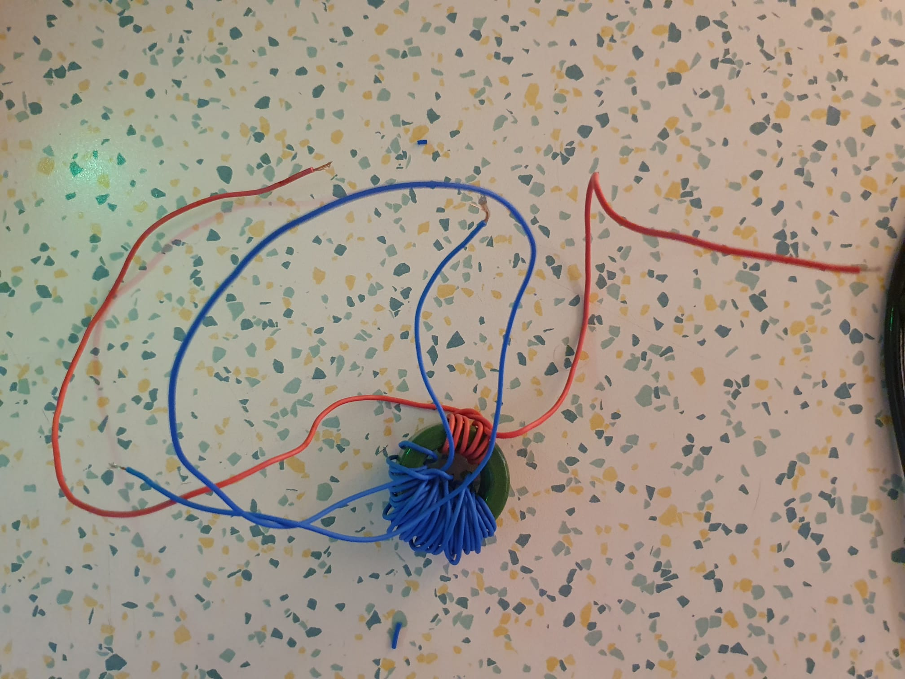
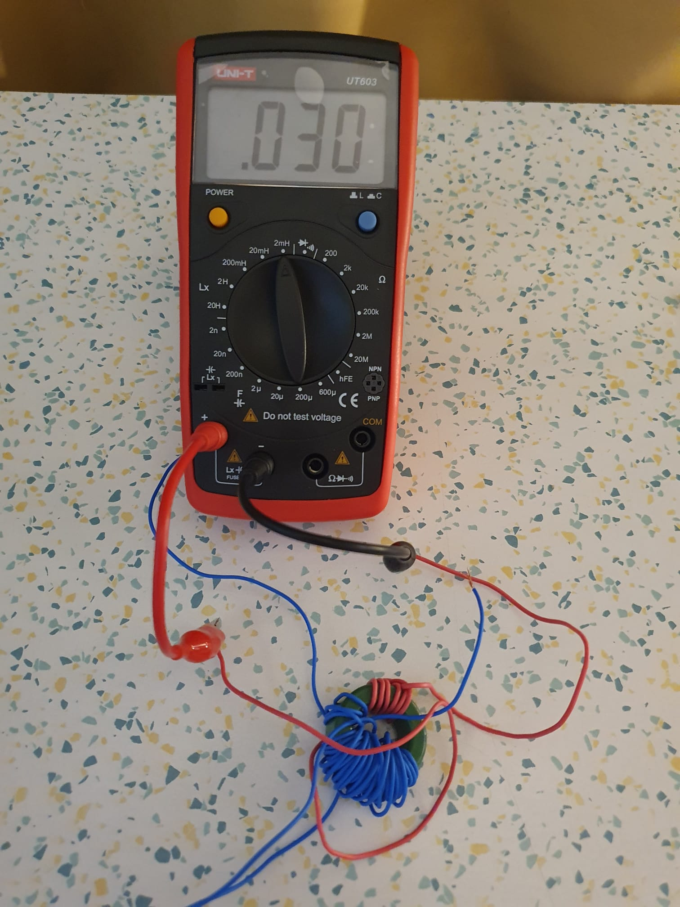
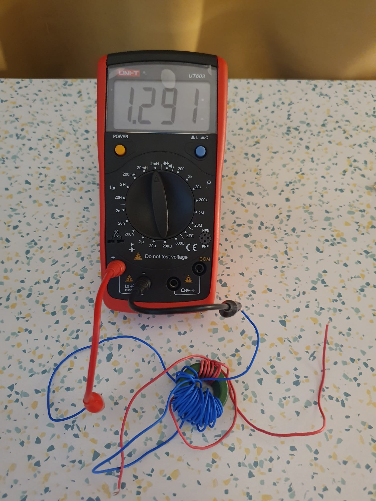
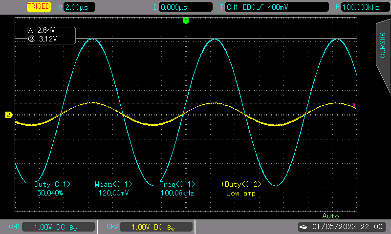

# First Transformer Experiment
The wounded toroidal transformer is tested with 100 kHz sinusoidal waveform with a signal generator.

## Transformer

## Primary Inductance

## Secondary Inductance

## Scope Waveforms

- Yellow: Primary
- Blue: Secondary